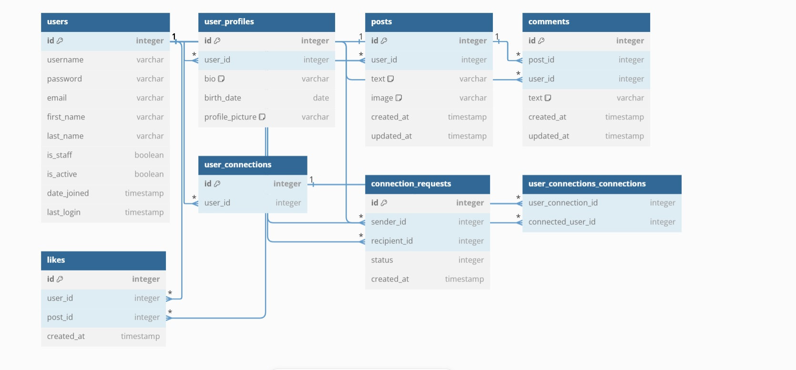

# TrendLink
A social media platform, that uses recommendation algorithms for personalized content and connections

## Table of Contents
- [Features](#features)
- [Tech Stack](#tech-stack)
- [Applications](#applications)
- [Requirements](#requirements)
- [Installation](#installation)
- [Docker configuration](#docker-configuration)
- [AWS S3 Configuration](#aws-s3-configuration)
- [Database Schema](#database-schema)


## Features

- User Registration and Authentication
- Profile Management
- Post Creation and Management
- Comment Creation and Management
- Connections Creation and Management
- Real-time notifications

## Applications
- **User**
- **Post**
- **Connection**

## Tech Stack

### Backend
- **Framework**: Django
- **API**: Django Rest Framework (DRF)
- **Database**: PostgreSQL
- **Channels backend**: Redis
- **Authentication**: SessionAuth
- **Containerization**: Docker
- **Proxy Server**: Nginx
- **Storage**: AWS S3*

### Frontend
- **HTML/CSS**
- **JavaScript**
- **JQuery**

*production only

## Requirements

- Docker
- Docker Compose

## Installation

1. **Clone the Repository:**

   ```bash
   git clone https://github.com/BGabor01/TrendLink.git 
   ```

2. **Create an .env File:**

    Create an .env file in the project root with the following content:
    ```bash
    # Django Settings
    DJANGO_SECRET_KEY=your_secret_key 

    # PostgreSQL Database Settings
    POSTGRES_DB=your_db_name          
    POSTGRES_USER=your_db_user       
    POSTGRES_PASSWORD=your_db_password  

    # AWS S3 Settings (Production only)
    AWS_ACCESS_KEY_ID=your_access_key_id            
    AWS_SECRET_ACCESS_KEY=your_secret_access_key    
    AWS_STORAGE_BUCKET_NAME=your_bucket_name        
    AWS_S3_REGION_NAME=region_of_your_bucket
    ```

3. **Build the docker containers**
    ```bash
    docker-compose build
    ```

4. **Start the applications:**
    ```bash
    docker-compose up
    ```

## Docker Configuration
The DockerFile uses the `python:3.11-slim` base image. <br>
The services are defined in the `docker-compose.yml`.

**Django**
- Service name: `django`

**Database (PostgreSQL)**
- Service name: `postgres`

**Channels backend (Redis)**
- Service name: `redis`

**Nginx**
- Service name: `nginx`
- The configuration file is located at `trend_link/nginx.conf`.

## AWS S3 Configuration
AWS S3 is used for storing static and media files in production. <br>
Follow these steps to configure AWS S3.

1. **Create an S3 Bucket**:
    - Go to the AWS S3 console and create a new bucket.
    - Disable the block public access settings to allow public access to the bucket.

2. **Configure Bucket Policies**
    - Set the appropriate bucket policy to allow public read access.

    Example

    ```bash
        {
            "Version": "2012-10-17",
            "Statement": [
                {
                "Sid": "PublicReadGetObject",
                "Effect": "Allow",
                "Principal": "*",
                "Action": "s3:GetObject",
                "Resource": "arn:aws:s3:::your_bucket_name/*"
                }
            ]
        }
    ```

    - Configure CORS policy for the bucket

    Example

    ```bash
    [
        {
            "AllowedHeaders": ["*"],
            "AllowedMethods": ["GET"],
            "AllowedOrigins": ["*"],
            "ExposeHeaders": []
        }
    ]
    ```

3. **Set Up IAM Permissions**
    - Create an `IAM` user with `AmazonS3FullAccess` permissions.
    - Generate access keys for the IAM user.

## Database Schema
